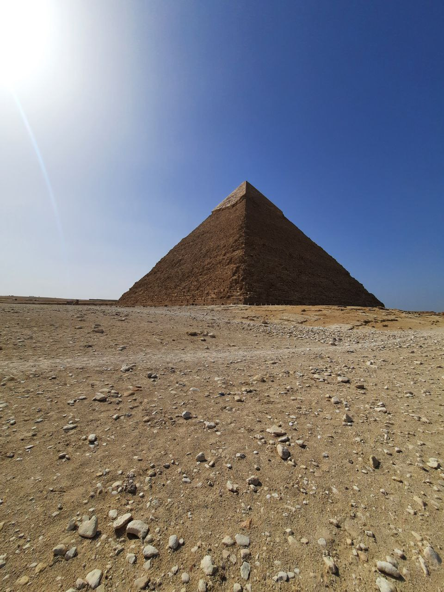

# Я Пожалов Алексей Игоревич

## Студент Нетологии, обучающийся на frontend-разработчика.

### Недавно я ездил путешествовать в Египет со своей девушкой Екатериной, было не забываемо круто и весело, но не без изъянов)

*Здесь прикреплю несколько фотографий из путешествия*

## Гора Моисея в Сант-Катарине

## Берега Саудовской Аравии со стороны Синайского полуострова

## Пирамида Хефрена в Каире

### И две мои фотографии сделанные дамой моего сердца<3

